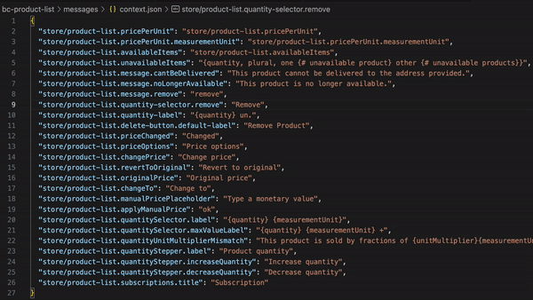

# vtex-fix-context-json README

This is for VTEX Apps

Fixes the `messages/context.json` to set the key values as the key itself

# Usage

Select the lines to sort, press F1 type sort and select the desired sort. The regular sort has the default hotkey F9.

